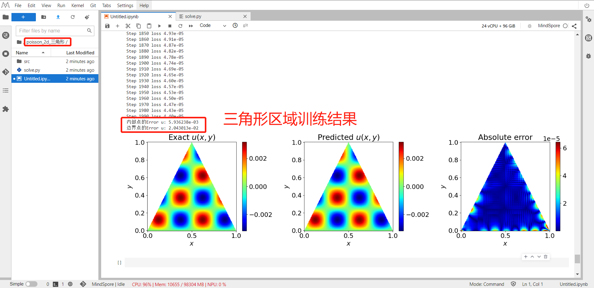
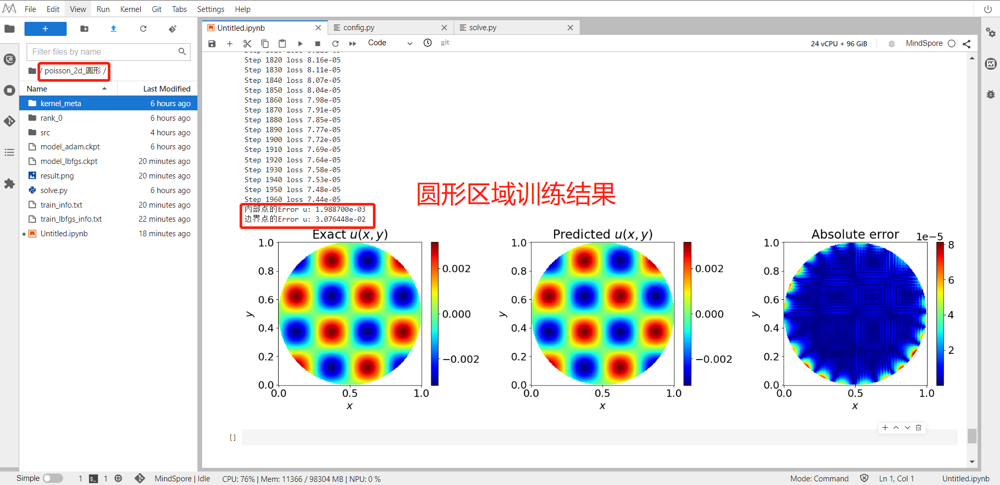
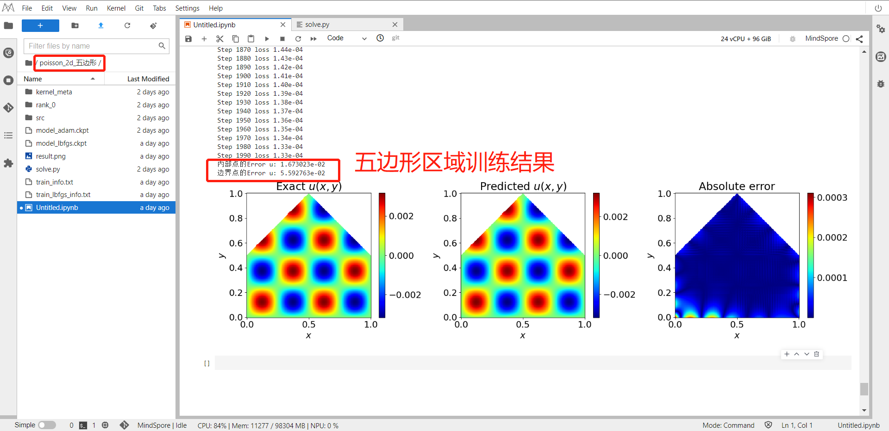
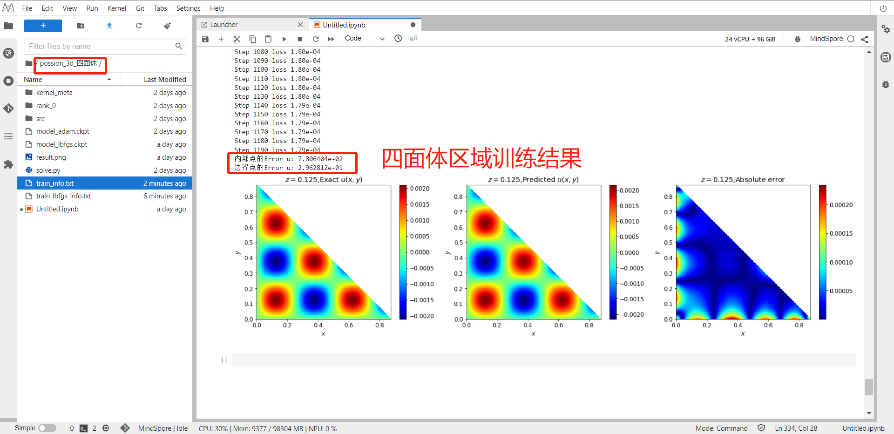
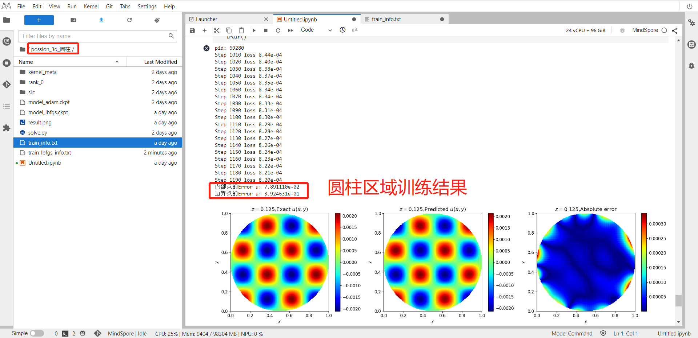
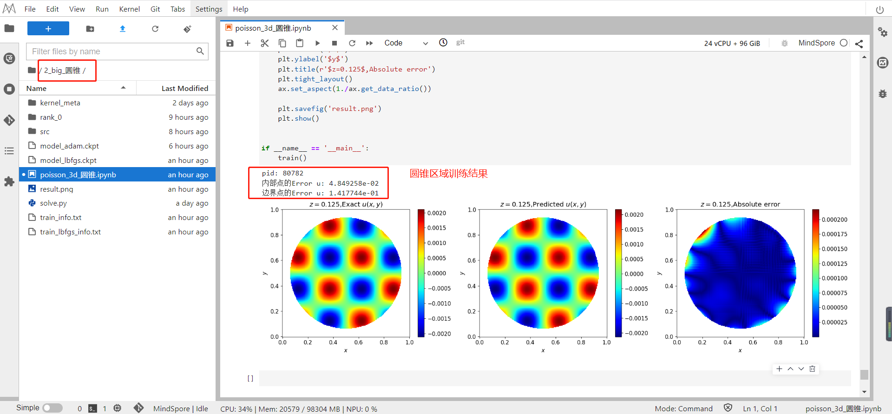

Physics-informed neural networks (PINNs), a new paradigm for solving partial differential equations\
(PDE), have attracted great attention due to its flexibility and simplicity. We use the PINNs method to solve 2D Poisson Equation with rectangle, triangular, round and pentagram domains and 3D Poisson Equation with tetrahedron, cylinder, cone domains.

The Poisson Equations are listed as follows:

$$\Delta$$

1. 2D Poisson  Equation result 

   

   

   

   
2. 3D Possion Equation result

   

   

   