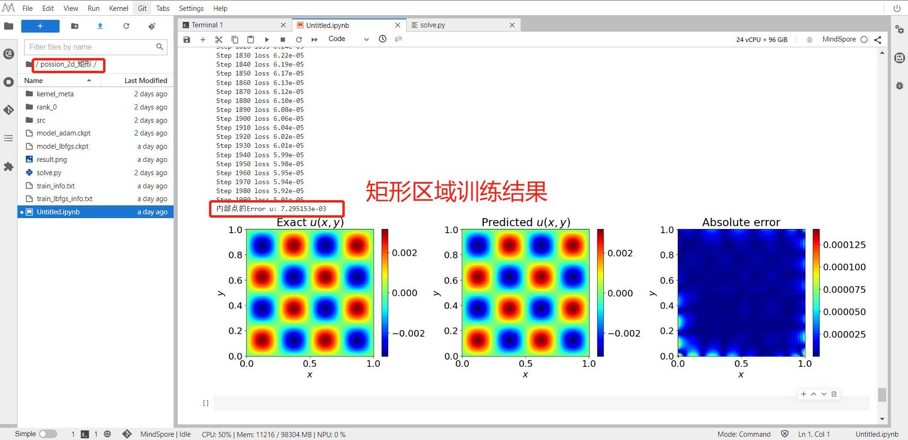

<!--StartFragment-->

Physics-informed neural networks (PINNs), a new paradigm for solving partial differential equations\
(PDE), have attracted great attention due to its flexibility and simplicity. We use the PINNs method to solve 2D and 3D Possion Equations with rectangle，triangular, round and pentagram.

<!--EndFragment-->

1. 2D Possion  Equation result 

   
2. 3D Possion Equation result